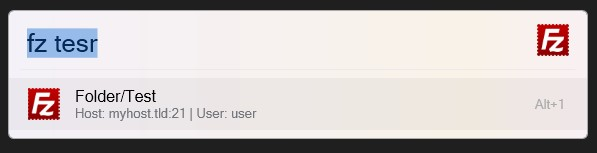

# Flow Launcher FileZilla Plugin

This plugin for Flow Launcher allows you to easily list and filter your FileZilla sessions directly from your desktop.

## Features

- Quickly access your FileZilla sessions without opening FileZilla itself.
- Fuzzy search functionality for efficient filtering of sessions.
- Seamless integration with Flow Launcher for a smooth user experience.

## Installation

### Automatic Installation from Flow Launcher Plugin Store

1. Open Flow Launcher.
2. Type 'Settings' and press Enter to open the settings window.
3. Go to the 'Plugins Store' tab.
4. Click on 'Get more plugins' and search for 'FileZilla'.
5. Click 'Install' to add the plugin to Flow Launcher.

### Manual Installation from GitHub Releases

1. Download the latest release of the plugin from the [releases page](https://github.com/shaffe-fr/flow-filezilla/releases).
2. Extract the downloaded files into the Plugins directory of your Flow Launcher installation. The Plugins directory is typically located here: `%appdata%\FlowLauncher\Plugins`.
3. Restart Flow Launcher to load the plugin.

## Usage

1. Open Flow Launcher using the designated hotkey.
2. Type 'fz' followed by a space to activate the plugin.
3. Start typing the name of the site you want to access. The plugin will filter the sessions dynamically based on your input using fuzzy search.
4. Use the arrow keys or mouse to select the desired site, then press Enter to open it in FileZilla.

## Configuration

The plugin will attempt to automatically guess the path to the FileZilla executable. If it fails to do so, or if FileZilla is installed in a non-standard location, you can manually configure the path in the plugin settings:

- Open Flow Launcher.
- Type 'Settings' and press Enter to open the settings window.
- Go to the 'Plugins' tab.
- Locate the 'FileZilla' plugin and click on it.
- In the settings for the plugin, enter the full path to the FileZilla executable.
- Click 'Save' to apply the changes.

## Feedback

If you encounter any issues, have questions, or would like to request features, please feel free to open an issue on the [GitHub repository](https://github.com/shaffe-fr/flow-filezilla/issues). Your feedback is greatly appreciated!

## License

This plugin is licensed under the [MIT License](LICENSE). Feel free to use, modify, and distribute it as you see fit.
